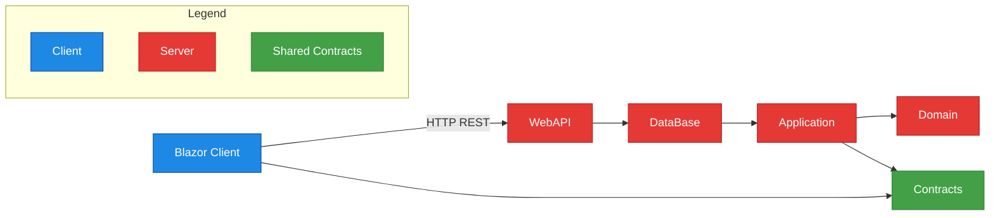

# Warehouse Management System (Blazor WASM + WebAPI)
Решение тестового задания "Приложение для управления складом", реализующей принципы DDD и Луковой архитектуры.

### Ключевые архитектурные принципы
- **Луковая архитектура** с четким разделением слоев:
  - `Client` - Клиентский интерфейс (Blazor WASM)
  - `Server` - Серверная часть (WebApi)
  - `Application` - Бизнес-логика и сценарии использования
  - `DataBase` - Реализация репозиториев, работа и конфигурирование БД
  - `Domain` - Хранилище доменных сущностей
  - `Contracts` - Контрактные модели используемые клиентской и серверной частью для общения

### Коммуникация между слоями

# Инструкция по запуску проекта Server

## Подключение к PostgreSQL

1. Откройте `appsettings.json`
2. Найдите блок `ConnectionStrings`
3. Замените параметры подключения:
"DbContext": {
    "ConnectionString": "Server=*адрес сервера (localhost)*;Port=*порт*;Database=Warehouse;User Id="Имя пользователя";Password=*Пароль*;Pooling=true;"
  }

## Запуск проекта

Запустите проект Server локально и перейдите по выданному https адрес: https://localhost:7085 

Сервер настраивается для обслуживания Blazor WebAssembly-клиента, но само выполнение кода происходит в браузере пользователя. База данных создается автоматически с помощью миграций и заполняется тестовыми данными с помощью сидов.

## Технологический стек
- `Клиент` - Blazor WASM;
- `Сервер` - ASP.NET Core WebAPI;
- `OРМ` - EF Core;
- `База данных` - PostgreSQL;
- `Маппинг` - Mapster;
- `Обработка ошибок` - ErrorOr;
- `Клиент` - Blazor WASM;
- `Паттерны` - UnitOfWork, Repository;
- `Язык` - C#
